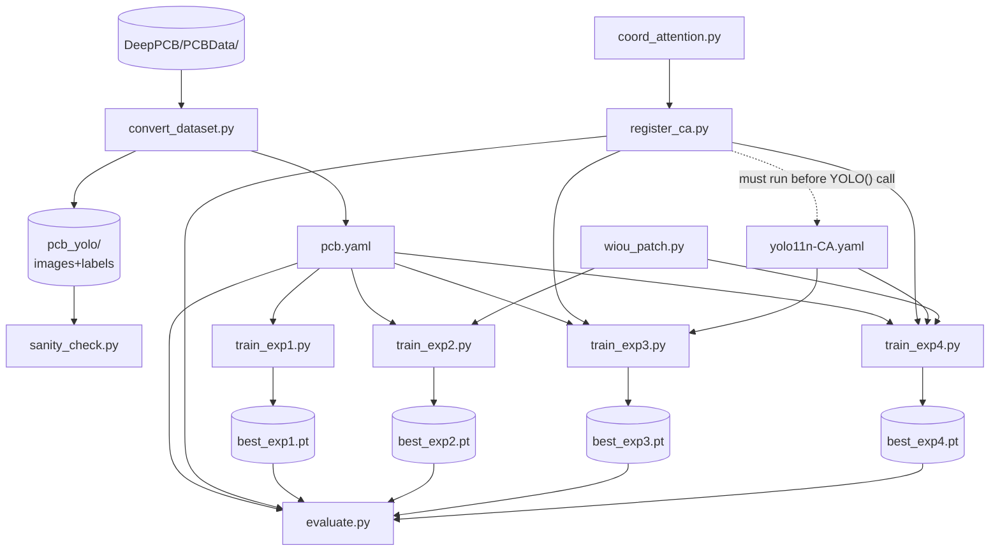

# FILE_DEPENDENCIES.md — AIT304 PCB Defect Detection
> Check this file BEFORE editing any code file. It tells you what else breaks.
> Append-only for side-effect discoveries; update the tables when files are added or renamed.

---

## 1. Dependency Diagram



### ASCII quick-reference (for when Mermaid doesn't render)

```
DeepPCB/PCBData/
  └─► convert_dataset.py
        ├─► pcb.yaml ──────────────────────────────► train_exp1.py ─► best_exp1.pt ─┐
        │                                            train_exp2.py ─► best_exp2.pt ─┤
        │                                            train_exp3.py ─► best_exp3.pt ─┤
        │                                            train_exp4.py ─► best_exp4.pt ─┤
        │                                            evaluate.py ◄───────────────────┘
        └─► pcb_yolo/ ─► sanity_check.py

coord_attention.py
  └─► register_ca.py ─┬─► train_exp3.py
                      ├─► train_exp4.py
                      └─► evaluate.py  (CA models only)

yolo11n-CA.yaml ──────┬─► train_exp3.py
(needs register_ca    └─► train_exp4.py
 loaded first)

wiou_patch.py ────────┬─► train_exp2.py
                      └─► train_exp4.py
```

---

## 2. File-by-File Impact Table

| File | Depends on | Affects (breaks if this changes) | Side effects | Before editing, also re-verify |
|---|---|---|---|---|
| `convert_dataset.py` | `DeepPCB/PCBData/` | `pcb.yaml`, `pcb_yolo/`, all `train_*.py`, `evaluate.py`, `sanity_check.py` | Writes `pcb_yolo/` to disk; produces `pcb.yaml` | Re-run `sanity_check.py`; confirm counts 800/200/500; confirm `cls = cls - 1` remapping |
| `pcb.yaml` | `convert_dataset.py` (produces it) | `train_exp{1-4}.py`, `evaluate.py` | None | Verify `nc: 6`, correct split paths, class name order matches DeepPCB spec |
| `coord_attention.py` | None (pure PyTorch) | `register_ca.py` → `train_exp3.py`, `train_exp4.py`, `evaluate.py` | None | If class is renamed: must also update string `"CoordAtt"` in `yolo11n-CA.yaml`; re-verify `ca_count == 3` |
| `register_ca.py` | `coord_attention.py` | `train_exp3.py`, `train_exp4.py`, `evaluate.py` | Injects `CoordAtt` into `ultralytics.nn.tasks` and `ultralytics.nn.modules` namespaces — persists for process lifetime | Re-run CA verification (`ca_count == 3`); confirm `register_coordatt()` prints `✓` |
| `yolo11n-CA.yaml` | `register_ca.py` must run first; references string `"CoordAtt"` | `train_exp3.py`, `train_exp4.py` | None | Re-run CA verification (`ca_count == 3`); check head layer index references if layers are added/removed |
| `wiou_patch.py` | None (patches ultralytics internals) | `train_exp2.py`, `train_exp4.py` | ⚠ Patches `ultralytics.utils.metrics.bbox_iou` AND `ultralytics.utils.loss.bbox_iou` — persists until kernel restart | After any edit: restart kernel, run a short CIoU training to confirm CIoU path unaffected; run a short WIoU training to confirm patch still activates |
| `sanity_check.py` | `pcb_yolo/` (output of `convert_dataset.py`) | Nothing downstream | None | Visual confirmation: red boxes wrap visible defects; class IDs shown are 0–5 |
| `train_exp1.py` | `pcb.yaml` | `best_exp1.pt`, `results/exp1_*/` | None | Re-run EXP-1 to regenerate weights |
| `train_exp2.py` | `pcb.yaml`, `wiou_patch.py` | `best_exp2.pt`, `results/exp2_*/` | Calls `apply_wiou_patch()` — activates the global monkey-patch | Confirm `✓ WIoU patch applied` message; restart kernel before running EXP-1 or EXP-3 |
| `train_exp3.py` | `pcb.yaml`, `register_ca.py`, `coord_attention.py`, `yolo11n-CA.yaml` | `best_exp3.pt`, `results/exp3_*/` | Calls `register_coordatt()` | Confirm `ca_count == 3` assert passes before training starts |
| `train_exp4.py` | `pcb.yaml`, `wiou_patch.py`, `register_ca.py`, `coord_attention.py`, `yolo11n-CA.yaml` | `best_exp4.pt`, `results/exp4_*/` | Calls `apply_wiou_patch()` + `register_coordatt()` | Confirm `✓ WIoU patch applied` + `ca_count == 3` — both must print before training |
| `evaluate.py` | `pcb.yaml`, `best_exp{1-4}.pt`; `register_ca.py` for CA models | `comparison_full.csv`, all charts in `results/` | Calls `register_coordatt()` | Confirm all 4 `.pt` files exist before running; CA models: `ca_count == 3` |

---

## 3. Side Effects That Persist Beyond One File

These are the footguns. Each one can cause a silent, hours-long wrong experiment.

### 3.1 — `wiou_patch.py` patches two ultralytics internals at runtime

`apply_wiou_patch()` replaces:
- `ultralytics.utils.metrics.bbox_iou`
- `ultralytics.utils.loss.bbox_iou`

Both replacements are live in the Python process from the moment `apply_wiou_patch()` is called until the Google Colab notebook is restarted. There is no clean revert (Python caches module object references; setting the name back does not undo references already held by loss class instances).

**This is why the kernel restart between CIoU and WIoU experiments is non-negotiable.**
Run order: EXP-1 → EXP-3 → **restart Google Colab runtime** → EXP-2 → EXP-4.

> **Compute platform note:** Google Colab is the active compute platform for this project, per D-011 (which supersedes the original Kaggle plan in D-007 — see D-007 amendment).

### 3.2 — `register_ca.py` injects into two ultralytics namespaces at runtime

`register_coordatt()` sets:
- `ultralytics.nn.tasks.CoordAtt = CoordAtt`
- `ultralytics.nn.modules.CoordAtt = CoordAtt`

This is also persistent for the process lifetime. Unlike the WIoU patch, this one is **safe to leave loaded** during non-CA experiments — it adds a class to a namespace but does not change any existing function behaviour. EXP-1 and EXP-2 do not call `YOLO('yolo11n-CA.yaml')`, so the injected class sits unused.

### 3.3 — `yolo11n-CA.yaml` resolves `"CoordAtt"` by string lookup

When `YOLO('yolo11n-CA.yaml')` is called, Ultralytics' `parse_model()` resolves the string `"CoordAtt"` against the `ultralytics.nn.tasks` module namespace. If `register_ca.py` has not run first, the string lookup fails with a `NameError` and the model will not load.

**Rename coupling:** The string `"CoordAtt"` in the YAML must exactly match the class name in `coord_attention.py`. If you rename the class (e.g. to `CoordinateAttention`), you must update the YAML in the same commit or the YAML becomes unloadable.

---

## 4. Edit Checklist Template

Copy-paste this before touching any code file:

```
Before editing FILE: __________
[ ] Read Section 2 row for this file in FILE_DEPENDENCIES.md
[ ] List files that depend on it: __________
[ ] List files it depends on: __________
[ ] Side effects active? (wiou_patch / register_ca): __________
[ ] Re-verify after edit:
    [ ] Test 1: __________
    [ ] Test 2: __________
[ ] If coord_attention.py class was renamed: update "CoordAtt" string in yolo11n-CA.yaml
[ ] If pcb.yaml paths changed: re-run sanity_check.py
[ ] If architectural change: update PROJECT_STATE.md "Recent Decisions"
[ ] If architectural change: append entry to DECISIONS.md
[ ] Commit message format: "edit <file>: <what changed> | affected: <files>"
```

---

*FILE_DEPENDENCIES.md v1 | Created 2026-06-14 | Update when files are added, renamed, or side effects discovered*
